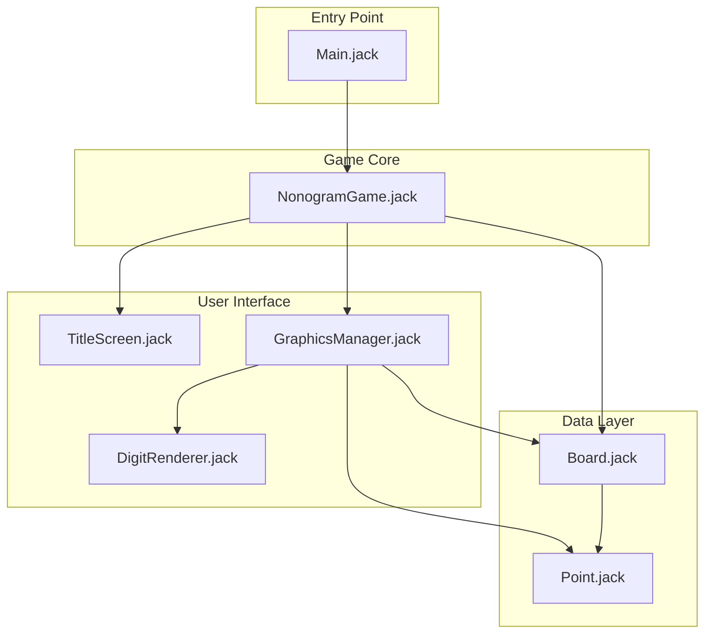
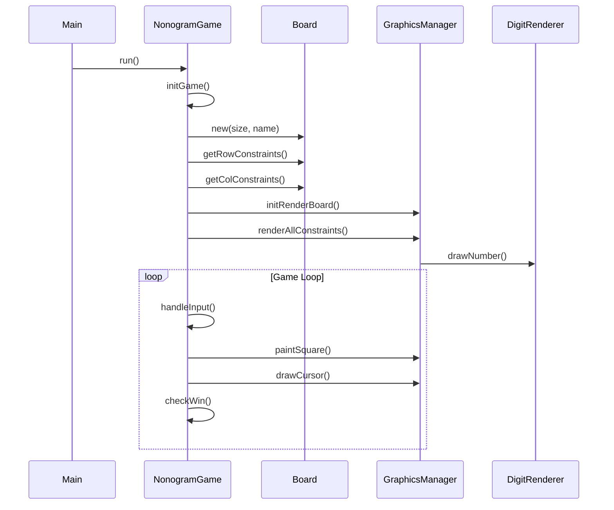

# Project 9: Nonogram Puzzle Game

## Video Demo

**Video Link:** [https://youtu.be/lkU1cDYD7k0](https://youtu.be/lkU1cDYD7k0)

---

## Concept / Idea

A **Nonogram** (also known as Picross or Griddlers) is a logic puzzle where the player fills in cells on a grid based on numeric constraints for each row and column. The constraints indicate the lengths of consecutive filled cells, helping the player deduce the correct pattern to reveal a hidden pixel-art image.

---

## Architecture

The game is built using a modular architecture with clear separation of concerns between game logic, rendering, and data management.

### System Architecture Diagram

### Class Interaction Diagram

### File Descriptions

| File | Purpose |
|------|---------|
| **Main.jack** | Entry point that initializes and starts the game by calling `NonogramGame.run()`. |
| **NonogramGame.jack** | Core game controller managing game state, input handling (arrow keys, spacebar, X for flags, S to skip, ESC to quit), puzzle loading, win detection using incremental mismatch counting, and puzzle cycling. Contains 5 hand-crafted 10×10 puzzles (Heart, Smiley, Cat, Spaceship, Turtle). |
| **Board.jack** | Data structure representing a 10×10 grid with three cell states (0=white, 1=black, 2=flagged). Provides static functions to generate row and column constraints from a solution board for the Nonogram rules. |
| **GraphicsManager.jack** | Handles all visual rendering including the grid (with thick lines every 5 cells), square painting, cursor display, flag markers, constraint numbers, and decorative border. Uses precise pixel calculations to avoid overdrawing grid lines. |
| **DigitRenderer.jack** | Custom 6×10 pixel digit renderer for displaying constraint numbers at any screen position. Provides precise control over number placement that the standard `Output` class cannot achieve. |
| **Point.jack** | Simple utility class storing x/y coordinates, used by GraphicsManager for grid origin positioning. |
| **TitleScreen.jack** | Displays the game title and instructions before gameplay begins. |

### Memory Management

The game implements careful memory management to prevent heap overflow:
- **Board reuse**: Solution and player boards are created once and cleared/reloaded for each puzzle
- **Constraint disposal**: Constraint arrays are properly deallocated before generating new ones
- **Explicit cleanup**: All dynamically allocated objects implement `dispose()` methods

---

## Motivation

I chose to create a Nonogram game because it combines logical puzzle-solving with pixel art in an elegant way. The challenge of implementing constraint generation, efficient win detection, and a custom digit renderer provided an excellent opportunity to explore the Jack language's capabilities while creating a genuinely fun and replayable game.

---

## Team Members

| Name | Email |
|------|-------|
| ___________________ | ___________________@___.___.___ |
| ___________________ | ___________________@___.___.___ |

---

## Controls

| Key | Action |
|-----|--------|
| ↑ ↓ ← → | Move cursor |
| Space | Toggle cell (black/white) |
| X | Toggle flag marker |
| S | Skip to next puzzle |
| ESC | Quit game |

